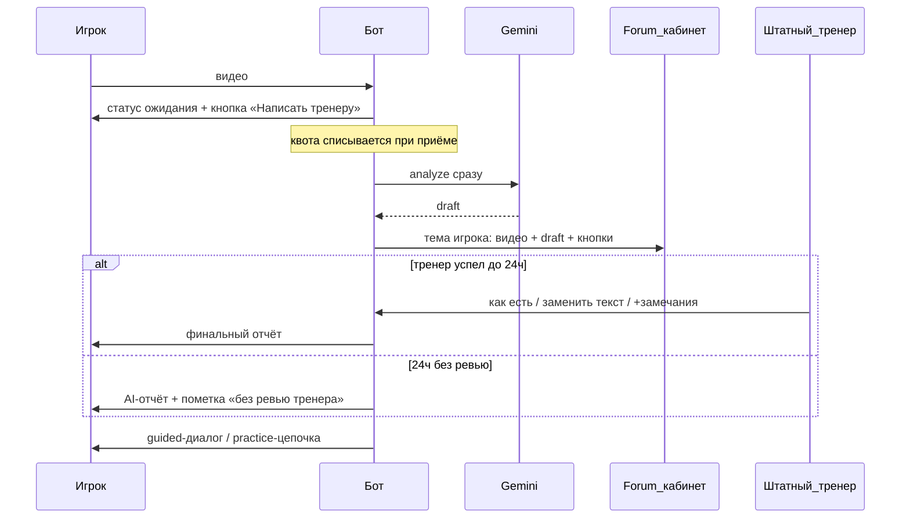

# RallyMind / RallyAI — Product V2

Документ зафиксирован по итогам product grill (август 2026).  
Источник истины для **human-in-the-loop разбора** и кабинета тренера в Telegram.  
Предыдущий [`PRODUCT.md`](PRODUCT.md) описывает V1 (мгновенный AI); при конфликте по пайплайну разбора приоритет у **этого файла**.

---

## 1. Продуктовая идентичность (V2)

**RallyMind** — Telegram-бот, где разбор техники делает **штатный тренер** с AI-помощником.

| Было (V1) | Стало (V2) |
|-----------|------------|
| AI отвечает игроку за ~минуту | Игрок всегда ждёт человека; AI — внутренний черновик |
| «Домашка между занятиями со своим тренером» | «Разбор от тренера RallyMind + AI» |
| B2B-кабинет внешних тренеров — вне scope | v1 штатный тренер; **позже** — внешние тренеры своих учеников |

**Не цель V2:** веб-админка, multi-tenant SaaS для клубов, посекционный редактор отчёта.

---

## 2. Кто есть кто

| Роль | Кто | Зона ответственности |
|------|-----|----------------------|
| **Игрок** | B2C пользователь бота | Шлёт видео, ждёт отчёт, practice-цепочка после доставки |
| **Штатный тренер** | Контракт / сотрудник RallyMind | Ревьюит AI-черновик в Forum-кабинете, правит, отправляет |
| **Владелец продукта** | Основатель | Создаёт Forum-группу, выдаёт доступы, задаёт `.env`, приоритеты очереди |
| **Инженерия** | Разработка (в т.ч. Cursor-агент по задаче) | Код бота, БД заявок, Forum API, cron fallback, тесты, деплой |
| **Внешний тренер** | *Фаза 2, не V2 launch* | Разбор только своих учеников в своём контуре доступа |

---

## 3. Пайплайн разбора (обязательный)

### Решения grill (зафиксировано)

| Тема | Решение |
|------|---------|
| Модель доставки | Всегда очередь к человеку (не опциональный SKU) |
| SLA | Жёсткого нет |
| Fallback | Через **24 часа** — AI с явной пометкой |
| Когда Gemini | Сразу при загрузке видео |
| Кабинет | Супергруппа + **Forum Topics** (тема = игрок) + бот |
| Правки тренера | «Отправить как есть» · «Заменить весь текст» · «Замечания тренера» |
| Пока ждёт игрок | Только статус; опционально «Сообщение тренеру» |
| Follow-up / practice | Только после финальной доставки (`sent_coach` / `sent_fallback`) |
| Квота | При постановке в очередь; fallback повторно не списывает |
| Роллаут | Сразу для всех (Free и Pro) |

### Копирайт игроку (ориентир)

> Видео получил. Разбор сделает наш тренер вместе с AI-помощником. Обычно это занимает до суток — иногда быстрее. Напишу, как будет готово.

Кнопка: **Написать тренеру**.

Пометка fallback:

> Это предварительный разбор AI: тренер не успел проверить вручную. Можно опираться на него на тренировке; при следующем видео тренер посмотрит приоритетнее.

---

## 4. Кабинет Forum — что это

**Кабинет** = одна Telegram-супергруппа с включёнными Topics («темы»).

- Одна **тема** ≈ «вкладка» игрока: история видео, AI-черновики, замечания тренера, сообщения от игрока.
- Бот — единственный системный автор заявок и кнопок действий.
- Штатный тренер работает глазами и руками в этой группе; отдельный веб не нужен в V2.

Название темы (ориентир): `{first_name} · {user_id}` или `@username · {user_id}`.

---

## 5. Кто и как имплементит Кабинет Forum

Разделение обязательно: **Telegram-инфраструктуру кабинета создаёт человек; логику тем и заявок пишет инженерия в коде бота.**

### 5.1. Владелец продукта (разовый setup, не код)

1. Создать супергруппу (например `RallyMind · Кабинет тренера`).
2. Включить **Topics** (Forum).
3. Добавить бота RallyMind **администратором** с правами минимум:
   - управление темами (`can_manage_topics`);
   - отправка сообщений / медиа;
   - (желательно) приглашение пользователей — только если сами выдаёте доступ тренеру через бота.
4. Добавить штатного тренера в группу (как участника или админа без лишних прав на удаление группы).
5. Узнать `chat_id` супергруппы (обычно `-100…`) и прописать в `.env` на VPS:
   - `COACH_FORUM_CHAT_ID=...`
   - `COACH_USER_IDS=...` (Telegram user_id штатного тренера; можно несколько через запятую)
6. Проверить, что бот может создать тестовую тему вручную/скриптом после деплоя.

Без этих шагов код кабинета **не заработает**, даже если merge в репозиторий идеальный.

### 5.2. Инженерия (код бота + деплой)

Делает разработка (по задаче — Cursor-агент или человек-разработчик) в репозитории `rAI`:

| Компонент | Реализация |
|-----------|------------|
| Создание / поиск темы | Bot API `createForumTopic` → сохранить `message_thread_id` на `user_id` |
| Пост заявки | `sendVideo` / `copyMessage` + `sendMessage` **с** `message_thread_id` в `COACH_FORUM_CHAT_ID` |
| Черновик AI | Не слать игроку; сохранить в `review_jobs.draft_text` |
| Кнопки в теме | Inline: отправить / заменить текст / замечания / (служебно) |
| Режим правки | Ожидание следующего сообщения от `COACH_USER_IDS` в том же thread |
| Доставка игроку | Финальный текст + существующий analysis-dialog / practice |
| Fallback 24ч | Cron / `remind.py`-подобный job: `queued|in_review` старше 24ч → `sent_fallback` |
| Сообщение тренеру | Кнопка у игрока → текст в тему игрока |
| Задел фазы 2 | Поле `reviewer_id` (и позже `org_id`) в заявке; в V2 всегда штатный |

Стек: текущий `python-telegram-bot`, SQLite (`storage.py`), без нового сервиса и без второго бота в V2.

Ключевые точки кода (план):

- `bot.py` — разрыв «analyze → сразу игроку»; enqueue; handlers coach callbacks / reply
- `storage.py` — `review_jobs`, `player_forum_topics`
- `config.py` / `.env.example` — `COACH_FORUM_CHAT_ID`, `COACH_USER_IDS`
- `remind.py` или `review_fallback.py` + `deploy/` cron
- `i18n.py` — статусы, fallback-пометка
- тесты на статусы заявки, fallback, ACL коуча

### 5.3. Штатный тренер (эксплуатация, не разработка)

1. Работать только в Forum-группе.
2. Открывать тему игрока с непросмотренной заявкой.
3. Смотреть видео + AI-черновик.
4. Нажать одно из:
   - **Отправить как есть**
   - **Заменить текст** → следующим сообщением полный финальный отчёт
   - **Замечания тренера** → следующим сообщением аддендум (бот склеит с AI-черновиком)
5. Не обещать игроку точное время; при перегрузе — приоритет свежих / Pro (политика вручную в V2).

### 5.4. Что не делает «кабинет сам»

- Не создаёт супергруппу и не включает Topics.
- Не выдаёт тренеру доступ в Telegram без invite от владельца.
- Не является B2B-кабинетом внешних тренеров (фаза 2).

### 5.5. Фаза 2 (задел, не launch V2)

Внешний тренер ученика:

- отдельный доступ (своя группа или whitelist `reviewer_id` ↔ `student_user_id`);
- видит только своих игроков;
- тот же UX кнопок A+C;
- биллинг/квоты на org — отдельное продуктовое решение.

В коде V2 достаточно полей и одного штатного `reviewer_id`, без UI мультиаренды.

---

## 6. Данные (минимум)

### `review_jobs`

- `id`, `user_id`, `reviewer_id` (nullable → штатный по умолчанию)
- `video_file_id`, `draft_text`, `final_text`, `coach_notes`
- `forum_chat_id`, `message_thread_id`, `coach_message_ids` (опционально)
- `status`: `queued` \| `in_review` \| `sent_coach` \| `sent_fallback` \| `cancelled`
- `created_at`, `sent_at`
- снимок фокуса/упражнения для practice после send

### `player_forum_topics`

- `user_id` PK
- `forum_chat_id`, `message_thread_id`
- `created_at`, `title`

Одна активная незакрытая заявка на пользователя (новый разбор отменяет/архивирует предыдущую в `queued`, если ещё не отправлена — политика: **новый видео = новая заявка**, старую `cancelled` если не sent).

---

## 7. Монетизация (наследование + следствие V2)

На launch V2 сохраняем текущие лимиты и Stars-цену из кода (`billing.py`), пока отдельно не решим пересмотр.

Следствие human-in-the-loop:

- себестоимость разбора = API + **время тренера**;
- при росте Free без лимита очереди штатный тренер станет бутылочным горлышком;
- рычаги (не в launch, держать в уме): лимит pending, приоритет Pro, отдельный SKU «гарантированный слот».

Квота по-прежнему списывается при приёме видео в очередь.

---

## 8. Границы V2 launch

### Делаем

- Очередь ревью + Forum-кабинет + кнопки A+C
- Статус игроку + «Написать тренеру»
- AI сразу, игроку — только после send / fallback 24ч
- Cutover для всех пользователей
- Practice / dialog после доставки
- Задел `reviewer_id`

### Не делаем в launch

- Веб-кабинет
- Отдельный coach-бот
- Посекционное редактирование
- Multi-tenant для внешних тренеров / клубов
- Жёсткий SLA и компенсации за просрочку
- Автоматический приоритет Pro в очереди (можно вручную)

---

## 9. Критерии готовности к launch V2

| Блок | Порог |
|------|-------|
| **Setup** | Forum-группа создана; бот admin с `can_manage_topics`; `.env` заполнен |
| **Happy path** | Видео → тема → «как есть» → игрок получил отчёт и practice-вопрос |
| **Edit path** | «Заменить текст» и «Замечания» доставляют корректный финал |
| **Fallback** | Заявка без действий тренера через 24ч уходит с пометкой |
| **Изоляция** | Кнопки coach не срабатывают у обычного игрока |
| **Регрессия** | Квоты, Stars, `/grant`, remind/practice не ломают sent-заявки |

---

## 10. Порядок реализации (инженерия)

1. Setup-док + env (`COACH_FORUM_CHAT_ID`, `COACH_USER_IDS`) — владелец создаёт группу параллельно.
2. Таблицы `review_jobs` / `player_forum_topics`.
3. Разрыв пайплайна в `bot.py`: AI → job, не игроку.
4. `createForumTopic` + пост видео/черновика/кнопок.
5. Callback + reply-режимы A+C → доставка игроку + dialog/practice.
6. Cron fallback 24ч.
7. Кнопка «Написать тренеру».
8. Тесты + деплой + прогон с штатным тренером на 3–5 реальных видео.

Оценка объёма: **крупный контур** (~1.5–3 недели одного разработчика при узком scope выше), не «маленькая фича».

---

## 11. Резюме в одном предложении

**V2:** каждый разбор проходит через штатного тренера в Telegram Forum-кабинете (тема на игрока), AI готовит черновик сразу; если за 24 часа ревью нет — игроку уходит AI с пометкой; внешние тренеры учеников — следующая фаза на той же модели заявок.
